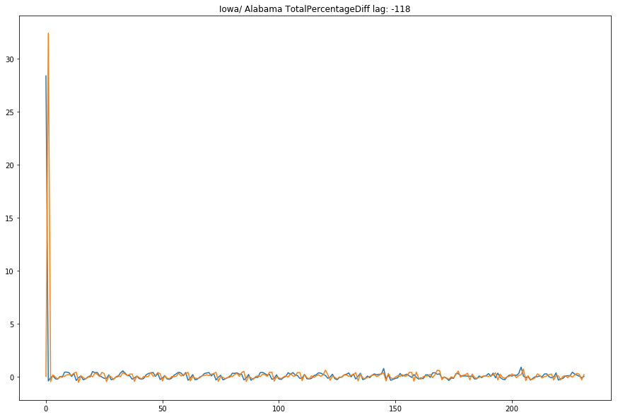
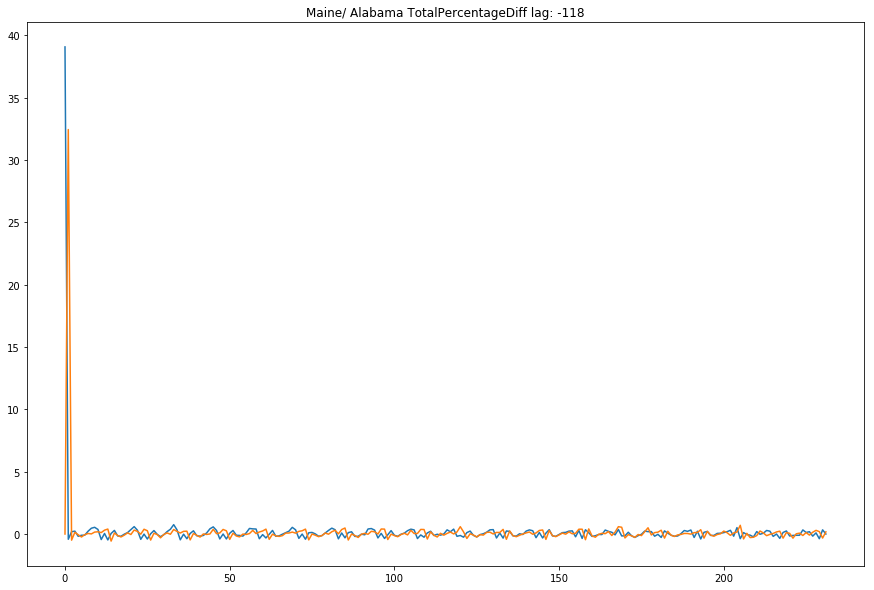
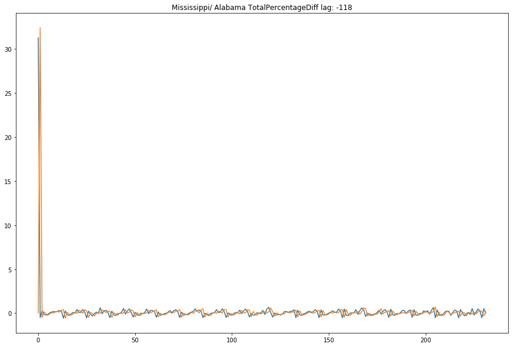

## Data Imputation


```python
import numpy as np # linear algebra
import pandas as pd # data processing, CSV file I/O 
import warnings


warnings.filterwarnings('ignore')

from pandas import DataFrame
import matplotlib.pyplot as plt

from matplotlib import interactive
interactive(True)
```

#### In the US, data is recorded on fire arms background checks.


```python
df = pd.read_csv('./firearm.csv', parse_dates=['month'])

total_rows = 12760
df.head(3)

```


<div>
<style>
    .dataframe thead tr:only-child th {
        text-align: right;
    }

    .dataframe thead th {
        text-align: left;
    }

    .dataframe tbody tr th {
        vertical-align: top;
    }
</style>
<table border="1" class="dataframe">
  <thead>
    <tr style="text-align: right;">
      <th></th>
      <th>month</th>
      <th>state</th>
      <th>permit</th>
      <th>permit_recheck</th>
      <th>handgun</th>
      <th>long_gun</th>
      <th>other</th>
      <th>multiple</th>
      <th>admin</th>
      <th>prepawn_handgun</th>
      <th>...</th>
      <th>returned_other</th>
      <th>rentals_handgun</th>
      <th>rentals_long_gun</th>
      <th>private_sale_handgun</th>
      <th>private_sale_long_gun</th>
      <th>private_sale_other</th>
      <th>return_to_seller_handgun</th>
      <th>return_to_seller_long_gun</th>
      <th>return_to_seller_other</th>
      <th>totals</th>
    </tr>
  </thead>
  <tbody>
    <tr>
      <th>0</th>
      <td>2018-02-01</td>
      <td>Alabama</td>
      <td>24547.0</td>
      <td>0.0</td>
      <td>9220.0</td>
      <td>7172.0</td>
      <td>353.0</td>
      <td>490</td>
      <td>0.0</td>
      <td>15.0</td>
      <td>...</td>
      <td>0.0</td>
      <td>0.0</td>
      <td>0.0</td>
      <td>29.0</td>
      <td>39.0</td>
      <td>4.0</td>
      <td>0.0</td>
      <td>1.0</td>
      <td>2.0</td>
      <td>45171</td>
    </tr>
    <tr>
      <th>1</th>
      <td>2018-02-01</td>
      <td>Alaska</td>
      <td>214.0</td>
      <td>0.0</td>
      <td>2279.0</td>
      <td>1948.0</td>
      <td>268.0</td>
      <td>166</td>
      <td>0.0</td>
      <td>2.0</td>
      <td>...</td>
      <td>0.0</td>
      <td>0.0</td>
      <td>0.0</td>
      <td>17.0</td>
      <td>5.0</td>
      <td>6.0</td>
      <td>0.0</td>
      <td>0.0</td>
      <td>0.0</td>
      <td>5392</td>
    </tr>
    <tr>
      <th>2</th>
      <td>2018-02-01</td>
      <td>Arizona</td>
      <td>6513.0</td>
      <td>435.0</td>
      <td>14966.0</td>
      <td>9058.0</td>
      <td>1341.0</td>
      <td>934</td>
      <td>0.0</td>
      <td>15.0</td>
      <td>...</td>
      <td>0.0</td>
      <td>0.0</td>
      <td>0.0</td>
      <td>20.0</td>
      <td>18.0</td>
      <td>5.0</td>
      <td>0.0</td>
      <td>2.0</td>
      <td>0.0</td>
      <td>36281</td>
    </tr>
  </tbody>
</table>
<p>3 rows × 27 columns</p>
</div>


#### The following variables are in the dataset:


```python
df.dtypes
```


    month                        datetime64[ns]
    state                                object
    permit                              float64
    permit_recheck                      float64
    handgun                             float64
    long_gun                            float64
    other                               float64
    multiple                              int64
    admin                               float64
    prepawn_handgun                     float64
    prepawn_long_gun                    float64
    prepawn_other                       float64
    redemption_handgun                  float64
    redemption_long_gun                 float64
    redemption_other                    float64
    returned_handgun                    float64
    returned_long_gun                   float64
    returned_other                      float64
    rentals_handgun                     float64
    rentals_long_gun                    float64
    private_sale_handgun                float64
    private_sale_long_gun               float64
    private_sale_other                  float64
    return_to_seller_handgun            float64
    return_to_seller_long_gun           float64
    return_to_seller_other              float64
    totals                                int64
    dtype: object


```python

```

### Columns that have NA values


```python
df.columns[df.isnull().any()]
```


    Index(['permit', 'permit_recheck', 'handgun', 'long_gun', 'other', 'admin',
           'prepawn_handgun', 'prepawn_long_gun', 'prepawn_other',
           'redemption_handgun', 'redemption_long_gun', 'redemption_other',
           'returned_handgun', 'returned_long_gun', 'returned_other',
           'rentals_handgun', 'rentals_long_gun', 'private_sale_handgun',
           'private_sale_long_gun', 'private_sale_other',
           'return_to_seller_handgun', 'return_to_seller_long_gun',
           'return_to_seller_other'],
          dtype='object')


```python

```

### Percentage of missing values


```python
df_statistics = pd.DataFrame([100 - df.apply(lambda x: x.count(), axis=0)/12760*100])
df_statistics = pd.DataFrame(df_statistics.transpose())


df_statistics = pd.DataFrame([df_statistics.index, df_statistics.values]).transpose()
df_statistics = df_statistics.sort_values(1)

 

objects = df_statistics[0].values
y_pos = np.arange(len(df_statistics[0].values))
performance = df_statistics[1].values
 
plt.figure(figsize=(8, 6))  
plt.barh(y_pos, performance, align='center', alpha=0.8)
plt.yticks(y_pos, objects, fontsize=7)
plt.xlabel('Percentage Missing')
plt.title('Missing Percentage Before Data Imputation')

plt.show()
```


#### Look into tiny missing values


```python
 df_statistics.head(10)
```


<div>
<style>
    .dataframe thead tr:only-child th {
        text-align: right;
    }

    .dataframe thead th {
        text-align: left;
    }

    .dataframe tbody tr th {
        vertical-align: top;
    }
</style>
<table border="1" class="dataframe">
  <thead>
    <tr style="text-align: right;">
      <th></th>
      <th>0</th>
      <th>1</th>
    </tr>
  </thead>
  <tbody>
    <tr>
      <th>0</th>
      <td>month</td>
      <td>[0.0]</td>
    </tr>
    <tr>
      <th>7</th>
      <td>multiple</td>
      <td>[0.0]</td>
    </tr>
    <tr>
      <th>26</th>
      <td>totals</td>
      <td>[0.0]</td>
    </tr>
    <tr>
      <th>1</th>
      <td>state</td>
      <td>[0.0]</td>
    </tr>
    <tr>
      <th>5</th>
      <td>long_gun</td>
      <td>[0.148902821317]</td>
    </tr>
    <tr>
      <th>4</th>
      <td>handgun</td>
      <td>[0.156739811912]</td>
    </tr>
    <tr>
      <th>8</th>
      <td>admin</td>
      <td>[0.180250783699]</td>
    </tr>
    <tr>
      <th>2</th>
      <td>permit</td>
      <td>[0.188087774295]</td>
    </tr>
    <tr>
      <th>12</th>
      <td>redemption_handgun</td>
      <td>[15.2037617555]</td>
    </tr>
    <tr>
      <th>13</th>
      <td>redemption_long_gun</td>
      <td>[15.2115987461]</td>
    </tr>
  </tbody>
</table>
</div>


## Data Imputation

In general, most of the datasets have missing values in them. In the “Fire Arms Background Checks”, from
tablea above, it appears that there are 154595 “zero” values throughout the dataset. The missing percentage
ranges from 0% to 91.38% for various attributes. But it is worth noticing that, the missing values are actually
zeroes but not NA’s. Most of the R libraries and frameworks used for analysis automatically tend to ignore
all the NA values, excluding them from analysis even when they could be statistically compelling. Which
also means that we are left with little data to make out tests and conclusions on.

##### From the above table we see that 8 of the columns have missing values ranging from 0.14% to 15.24%. This could be replaced with mean for that state.

- **Make an array of dataframes of all different states**


```python
#Getting the list of states
states = np.unique(df['state'].values)

#Initialise empty array to fill in dataframes for different states
df_by_states = [0] * len(states)
i = 0


for state in states:
    df_by_states[i] = df.loc[df['state'] == state]
    i = i+1


```


```python

```

- **Make a list of all the columns that have to be filled with mean**


```python
columns_to_be_imputed = [
'long_gun',
'handgun',
'admin',
'permit',
'redemption_handgun',
'redemption_long_gun',
'prepawn_handgun',
'prepawn_long_gun',
'other',
'prepawn_other',
'redemption_other'
]
```


```python

```

- **Iterate through the dataframes from all the states **


```python
for i in range(0, len(states)):
    for column in columns_to_be_imputed:
        #print(" ==== Replacing for %s : ", column)
        #print("========== Before imputing ", df_by_states[i][column].isnull().sum())
        df_by_states[i][column].fillna(df_by_states[i][column].mean(), inplace=True)
        #print("========== After imputing ", df_by_states[i][column].isnull().sum())

print('Data Imputed')
```

    Data Imputed


- ** Combine the dataset from array to a new dataframe **


```python
dataframe_draft = pd.concat(df_by_states)

dataframe_draft.head().columns
```


    Index(['month', 'state', 'permit', 'permit_recheck', 'handgun', 'long_gun',
           'other', 'multiple', 'admin', 'prepawn_handgun', 'prepawn_long_gun',
           'prepawn_other', 'redemption_handgun', 'redemption_long_gun',
           'redemption_other', 'returned_handgun', 'returned_long_gun',
           'returned_other', 'rentals_handgun', 'rentals_long_gun',
           'private_sale_handgun', 'private_sale_long_gun', 'private_sale_other',
           'return_to_seller_handgun', 'return_to_seller_long_gun',
           'return_to_seller_other', 'totals'],
          dtype='object')


#### Checking the missing statsitics for after imputing data


```python
df_statistics_draft = pd.DataFrame([100 - dataframe_draft.apply(lambda x: x.count(), axis=0)/12760*100])
df_statistics_draft = pd.DataFrame(df_statistics_draft.transpose())


df_statistics_draft = pd.DataFrame([df_statistics_draft.index, df_statistics_draft.values]).transpose()
df_statistics_draft = df_statistics_draft.sort_values(1)


 
objects = df_statistics_draft[0].values
y_pos = np.arange(len(df_statistics_draft[0].values))
performance = df_statistics_draft[1].values
 
plt.figure(figsize=(8, 6))  
plt.barh(y_pos, performance, align='center', alpha=0.8)
plt.yticks(y_pos, objects, fontsize=7)
plt.xlabel('Percentage Missing')
plt.title('Missing Percentage Before Data Imputation')

plt.show()
```


```python
df_complete_column = dataframe_draft.loc[:, ['month',
                                            'multiple',
                                            'totals', 
                                            'state',
                                        'long_gun',
                                        'handgun',
                                        'admin',
                                        'permit',
                                        'redemption_handgun',
                                        'redemption_long_gun',
                                        'prepawn_handgun',
                                        'prepawn_long_gun',
                                        'other',
                                        'prepawn_other',
                                        'redemption_other']]


```


```python
df_complete_column.to_csv("OnlyImputedColumnFABC.csv", sep='\t')
dataframe_draft.to_csv("FewImputedColumnFABC.csv", sep='\t')
dataframe_draft.dropna().to_csv("AllColumnCompleteFABC.csv", sep='\t')
```


```python

```

## Data Analysis


```python

#importing packages for the prediction of time-series data
from statsmodels.tsa.arima_model import ARIMA
import statsmodels.api as sm
import statsmodels.tsa.api as smt
import statsmodels.formula.api as smf

from sklearn.metrics import mean_squared_error


```


```python
df = df_complete_column

df.head()
```


<div>
<style>
    .dataframe thead tr:only-child th {
        text-align: right;
    }

    .dataframe thead th {
        text-align: left;
    }

    .dataframe tbody tr th {
        vertical-align: top;
    }
</style>
<table border="1" class="dataframe">
  <thead>
    <tr style="text-align: right;">
      <th></th>
      <th>month</th>
      <th>multiple</th>
      <th>totals</th>
      <th>state</th>
      <th>long_gun</th>
      <th>handgun</th>
      <th>admin</th>
      <th>permit</th>
      <th>redemption_handgun</th>
      <th>redemption_long_gun</th>
      <th>prepawn_handgun</th>
      <th>prepawn_long_gun</th>
      <th>other</th>
      <th>prepawn_other</th>
      <th>redemption_other</th>
    </tr>
  </thead>
  <tbody>
    <tr>
      <th>0</th>
      <td>2018-02-01</td>
      <td>490</td>
      <td>45171</td>
      <td>Alabama</td>
      <td>7172.0</td>
      <td>9220.0</td>
      <td>0.0</td>
      <td>24547.0</td>
      <td>1778.0</td>
      <td>1502.0</td>
      <td>15.0</td>
      <td>15.0</td>
      <td>353.0</td>
      <td>0.0</td>
      <td>4.0</td>
    </tr>
    <tr>
      <th>55</th>
      <td>2018-01-01</td>
      <td>288</td>
      <td>38477</td>
      <td>Alabama</td>
      <td>6199.0</td>
      <td>5692.0</td>
      <td>0.0</td>
      <td>23930.0</td>
      <td>1050.0</td>
      <td>954.0</td>
      <td>12.0</td>
      <td>12.0</td>
      <td>276.0</td>
      <td>0.0</td>
      <td>1.0</td>
    </tr>
    <tr>
      <th>110</th>
      <td>2017-12-01</td>
      <td>513</td>
      <td>56545</td>
      <td>Alabama</td>
      <td>15765.0</td>
      <td>12895.0</td>
      <td>0.0</td>
      <td>24496.0</td>
      <td>1195.0</td>
      <td>1189.0</td>
      <td>16.0</td>
      <td>12.0</td>
      <td>390.0</td>
      <td>0.0</td>
      <td>4.0</td>
    </tr>
    <tr>
      <th>165</th>
      <td>2017-11-01</td>
      <td>483</td>
      <td>47418</td>
      <td>Alabama</td>
      <td>11675.0</td>
      <td>9927.0</td>
      <td>0.0</td>
      <td>21670.0</td>
      <td>1302.0</td>
      <td>1602.0</td>
      <td>15.0</td>
      <td>11.0</td>
      <td>292.0</td>
      <td>1.0</td>
      <td>4.0</td>
    </tr>
    <tr>
      <th>220</th>
      <td>2017-10-01</td>
      <td>337</td>
      <td>36619</td>
      <td>Alabama</td>
      <td>6999.0</td>
      <td>6144.0</td>
      <td>0.0</td>
      <td>20017.0</td>
      <td>1268.0</td>
      <td>1231.0</td>
      <td>15.0</td>
      <td>13.0</td>
      <td>308.0</td>
      <td>0.0</td>
      <td>2.0</td>
    </tr>
  </tbody>
</table>
</div>


#### Initial Inspections


```python
print (df.describe())
print ("=============================================================")
print (df.dtypes)


```

               multiple         totals       long_gun        handgun  \
    count  12760.000000   12760.000000   12760.000000   12760.000000   
    mean     271.361834   22012.392085    7833.496845    6050.224894   
    std      779.820198   33629.425268    9309.108343    8792.939589   
    min        0.000000       0.000000       0.000000       0.000000   
    25%       15.000000    4686.750000    2079.000000     879.000000   
    50%      126.000000   12519.500000    5133.500000    3105.000000   
    75%      303.250000   25846.500000   10415.250000    7413.000000   
    max    38907.000000  541978.000000  108058.000000  107224.000000   
    
                  admin         permit  redemption_handgun  redemption_long_gun  \
    count  12760.000000   12760.000000        12760.000000         12760.000000   
    mean      58.038581    6598.600773          413.748895           597.680488   
    std      598.627221   24679.038010          784.923755           941.837396   
    min        0.000000       0.000000            0.000000             0.000000   
    25%        0.000000       0.000000            0.000000             0.000000   
    50%        0.000000     547.000000           45.781726           173.000000   
    75%        0.000000    4411.000000          597.250000           873.250000   
    max    28083.000000  522188.000000        10046.000000          8831.000000   
    
           prepawn_handgun  prepawn_long_gun         other  prepawn_other  \
    count     12760.000000      12760.000000  12760.000000   12760.000000   
    mean          4.863408          7.773545    378.960866       0.188868   
    std          10.626883         15.750226    996.641679       0.730663   
    min           0.000000          0.000000      0.000000       0.000000   
    25%           0.000000          0.000000     44.038095       0.000000   
    50%           0.015228          1.000000    163.000000       0.000000   
    75%           5.000000          8.000000    430.000000       0.183673   
    max         164.000000        269.000000  77929.000000      49.000000   
    
           redemption_other  
    count      12760.000000  
    mean           1.888683  
    std            4.014825  
    min            0.000000  
    25%            0.000000  
    50%            0.397959  
    75%            2.510204  
    max           79.000000  
    =============================================================
    month                  datetime64[ns]
    multiple                        int64
    totals                          int64
    state                          object
    long_gun                      float64
    handgun                       float64
    admin                         float64
    permit                        float64
    redemption_handgun            float64
    redemption_long_gun           float64
    prepawn_handgun               float64
    prepawn_long_gun              float64
    other                         float64
    prepawn_other                 float64
    redemption_other              float64
    dtype: object


```python

```

- **Setting "month" as index and sorting by index**


```python
df_ts = df.set_index('month')
df_ts.sort_index(inplace=True, ascending=True)
print (type(df_ts))
df_ts.head()

#df_ts.loc[df_ts['state'] == states[0], ['multiple']].plot()
```

    <class 'pandas.core.frame.DataFrame'>


<div>
<style>
    .dataframe thead tr:only-child th {
        text-align: right;
    }

    .dataframe thead th {
        text-align: left;
    }

    .dataframe tbody tr th {
        vertical-align: top;
    }
</style>
<table border="1" class="dataframe">
  <thead>
    <tr style="text-align: right;">
      <th></th>
      <th>multiple</th>
      <th>totals</th>
      <th>state</th>
      <th>long_gun</th>
      <th>handgun</th>
      <th>admin</th>
      <th>permit</th>
      <th>redemption_handgun</th>
      <th>redemption_long_gun</th>
      <th>prepawn_handgun</th>
      <th>prepawn_long_gun</th>
      <th>other</th>
      <th>prepawn_other</th>
      <th>redemption_other</th>
    </tr>
    <tr>
      <th>month</th>
      <th></th>
      <th></th>
      <th></th>
      <th></th>
      <th></th>
      <th></th>
      <th></th>
      <th></th>
      <th></th>
      <th></th>
      <th></th>
      <th></th>
      <th></th>
      <th></th>
    </tr>
  </thead>
  <tbody>
    <tr>
      <th>1998-11-01</th>
      <td>5</td>
      <td>107</td>
      <td>Wyoming</td>
      <td>49.0</td>
      <td>45.0</td>
      <td>0.0</td>
      <td>8.0</td>
      <td>113.964467</td>
      <td>250.177665</td>
      <td>1.715736</td>
      <td>5.477157</td>
      <td>69.704762</td>
      <td>0.051020</td>
      <td>0.377551</td>
    </tr>
    <tr>
      <th>1998-11-01</th>
      <td>4</td>
      <td>17</td>
      <td>Pennsylvania</td>
      <td>8.0</td>
      <td>5.0</td>
      <td>0.0</td>
      <td>0.0</td>
      <td>0.015228</td>
      <td>0.030457</td>
      <td>0.015228</td>
      <td>0.045685</td>
      <td>53.419048</td>
      <td>0.000000</td>
      <td>0.000000</td>
    </tr>
    <tr>
      <th>1998-11-01</th>
      <td>0</td>
      <td>319</td>
      <td>New York</td>
      <td>279.0</td>
      <td>40.0</td>
      <td>0.0</td>
      <td>0.0</td>
      <td>5.050761</td>
      <td>13.289340</td>
      <td>9.928934</td>
      <td>0.370558</td>
      <td>608.761905</td>
      <td>0.122449</td>
      <td>1.153061</td>
    </tr>
    <tr>
      <th>1998-11-01</th>
      <td>8</td>
      <td>361</td>
      <td>Washington</td>
      <td>286.0</td>
      <td>65.0</td>
      <td>1.0</td>
      <td>1.0</td>
      <td>944.736041</td>
      <td>1138.609137</td>
      <td>5.010152</td>
      <td>7.071066</td>
      <td>1073.657143</td>
      <td>0.571429</td>
      <td>3.285714</td>
    </tr>
    <tr>
      <th>1998-11-01</th>
      <td>5</td>
      <td>344</td>
      <td>Oregon</td>
      <td>186.0</td>
      <td>153.0</td>
      <td>0.0</td>
      <td>0.0</td>
      <td>0.000000</td>
      <td>0.000000</td>
      <td>0.000000</td>
      <td>0.000000</td>
      <td>0.009524</td>
      <td>0.000000</td>
      <td>0.000000</td>
    </tr>
  </tbody>
</table>
</div>


```python

```

### The goal of this analysis is to create a correlation matrix for different states.


```python
import pandas as pd
from pandas.plotting import lag_plot
import numpy as np
import sklearn as sk
from sklearn import preprocessing as pr
from sklearn.linear_model import LinearRegression
import matplotlib.pyplot as plt
import matplotlib.patches as mpatches
from scipy.signal import correlate
from scipy.stats.mstats import spearmanr
from statsmodels.tsa.stattools import acf, adfuller
from statsmodels.graphics.tsaplots import plot_pacf

%matplotlib inline
from matplotlib import pylab
from matplotlib.font_manager import FontProperties
```


```python
#Initialise empty array to fill in dataframes for different states
df_by_states = [0] * len(states)
i = 0


for state in states:
    df_by_states[i] = df_ts.loc[df_ts['state'] == state]
    i = i+1
```

#### As previously stated, the goal of this analysis is to create a correlation matrix for these states. One way to find correlation between timeseries is to look at cross-correlation of the timeseries. Cross-correlation is computed between two timeseries using a lag, so when creating the correlation matrix we will specify the correlation as well as the lag. Before computing the cross correlation, it is important to have wide-sense station (often just called stationary) data. There are a few ways to make data stationary-- one of which is through differencing. But even after this it is famously difficult to avoid spurious correlations between timeseries data that are often caused by autocorrelation.


```python
# Differencing totals of previous row and next row.

i = 0

for state in states:
    df_by_states[i]['TotalDiff'] = df_by_states[i]['totals'].diff().fillna(0)
    i = i+1


```

**Now lets take a preliminary look at how our graph looks. Further steps may have to be taken to make the data stationary.**


```python
i = 0
%matplotlib inline

f = plt.figure(num=None, figsize=(20, 8), dpi=80, facecolor='w', edgecolor='k')
for state in states:
    plt.plot(df_by_states[i]['TotalDiff'], label=state)
    
    i=i+1
    
    
plt.legend(loc=9, bbox_to_anchor=(0.5, -0.1), ncol=5,prop={'size': 18})


plt.title('Monthly Differenced Totals')
plt.show()

#Looks like North Carolina has a huge spike
```


**Here we see that there are two states that have much larger spikes than the other states. While this may still have given us stationarity, it may be useful to also look at the percentage change per month of the timeseries.**


```python
# Differencing totals of previous row and next row.

i = 0

for state in states:
    df_by_states[i]['TotalPercentageDiff'] = df_by_states[i]['totals'].pct_change().fillna(0)
    i = i+1

    

i = 0

f = plt.figure(num=None, figsize=(20, 8), dpi=80, facecolor='w', edgecolor='k')
for state in states:
    plt.plot(df_by_states[i]['TotalPercentageDiff'], label=state)
    
    i=i+1
    
    
plt.legend(loc=9, bbox_to_anchor=(0.5, -0.1), ncol=5,prop={'size': 18})

plt.title('Monthly Percentage Difference of Total')
plt.show()

#Looks like North Carolina has a huge spike
```


** Note:**

As before, we still have some very large peaks, but overall the data looks more contained than previously. Most importantly, we do not have a single state dominating the others.


- **Focus on one particular part of the graph to get an idea of any correlation going on for few states.**


```python

i = 0

f = plt.figure(num=None, figsize=(20, 8), dpi=80, facecolor='w', edgecolor='k')
for state in states[0:6]:
    plt.plot(df_by_states[i]['TotalPercentageDiff'][-10:], label=state)
    
    i=i+1
    
    
plt.legend(loc=9, bbox_to_anchor=(0.5, -0.1), ncol=5,prop={'size': 18})

plt.title('Monthly Percentage Difference of Total')
plt.show()

```


```python
pd.concat(df_by_states).to_csv("all.csv", sep=',')
```

## Stationarity

We can test for stationarity by using *unit root tests*. One of which is the Augmented Dickey-Fuller Test. Dickey Fuller utilizes the following regression.

$$ Y'_t \space = \space \phi Y_{t-1} \space + \space b_1 Y'_{t-1} \space + \space b_2 Y'_{t-2} \space +...+ \space b_p Y'_{t-p} $$
$$ $$
$$ Y'_t \space = \space Y_t \space - \space Y_{t-1} $$

Using the Augmented Dickey Fuller test, we look at the following statistic.

$$ DF_t \space = \space \frac{\hat{\phi}}{SE(\hat{\phi})} $$

Then this statistic is compared to a table given by Dickey Fuller. Given the number of samples, we can guess with a % certainty whether or not our data is stationary.

$$ H_{0} \space : data \space is \space nonstationary $$
$$ H_{A} \space : data \space is \space stationary $$

To check these hypotheses, we look at the p-value of our given statistic using table (web.sgh.waw.pl/~mrubas/EP/TabliceStatystyczneDF.doc). On the table we look at model 2 with 500 < n. Form here we can see that in order to know with 5% certainty whether or not our data is stationary, we can compare our $ DF_t $ statistic to the values 3.46 and 3.44.


```python
i = 0 

for state in states:
    print("\n - ", state)
    adf = adfuller(df_by_states[i]['TotalDiff'][1:])
    print(state, 'ADF Statistic: %f' % adf[0])
    print(state, 'p-value: %f' % adf[1])
    print(state, 'Critical Values', adf[4]['1%'])
    print(adf)

    i = i+1
    

```

    
     -  Alabama
    Alabama ADF Statistic: -3.682294
    Alabama p-value: 0.004369
    Alabama Critical Values -3.46099220133
    (-3.6822939438750009, 0.0043692121447102689, 14, 216, {'1%': -3.4609922013325267, '5%': -2.8750157409630139, '10%': -2.5739524288408777}, 4307.6327271754462)
    
     -  Alaska
    Alaska ADF Statistic: -5.420119
    Alaska p-value: 0.000003
    Alaska Critical Values -3.46084927054
    (-5.4201193930267113, 3.0727444127863214e-06, 13, 217, {'1%': -3.4608492705449518, '5%': -2.8749531881358501, '10%': -2.5739190539191745}, 3465.1668488353762)
    
     -  Arizona
    Arizona ADF Statistic: -4.608154
    Arizona p-value: 0.000125
    Arizona Critical Values -3.46056737261
    (-4.6081535134457949, 0.00012477289939398929, 11, 219, {'1%': -3.4605673726102988, '5%': -2.8748298090333861, '10%': -2.5738532259544211}, 3993.3467736392317)
    
     -  Arkansas
    Arkansas ADF Statistic: -7.406466
    Arkansas p-value: 0.000000
    Arkansas Critical Values -3.46056737261
    (-7.4064660455834632, 7.322679287517774e-11, 11, 219, {'1%': -3.4605673726102988, '5%': -2.8748298090333861, '10%': -2.5738532259544211}, 3906.3161380855236)
    
     -  California
    California ADF Statistic: -4.458487
    California p-value: 0.000234
    California Critical Values -3.46056737261
    (-4.4584870766795657, 0.00023354156548707107, 11, 219, {'1%': -3.4605673726102988, '5%': -2.8748298090333861, '10%': -2.5738532259544211}, 4796.0827400135959)
    
     -  Colorado
    Colorado ADF Statistic: -4.890988
    Colorado p-value: 0.000036
    Colorado Critical Values -3.46056737261
    (-4.8909877959012658, 3.6310729715925986e-05, 11, 219, {'1%': -3.4605673726102988, '5%': -2.8748298090333861, '10%': -2.5738532259544211}, 4154.8923454930891)
    
     -  Connecticut
    Connecticut ADF Statistic: -3.406657
    Connecticut p-value: 0.010734
    Connecticut Critical Values -3.46099220133
    (-3.4066568829114079, 0.010734021431915066, 14, 216, {'1%': -3.4609922013325267, '5%': -2.8750157409630139, '10%': -2.5739524288408777}, 3956.9767660853245)
    
     -  Delaware
    Delaware ADF Statistic: -5.565053
    Delaware p-value: 0.000002
    Delaware Critical Values -3.46056737261
    (-5.5650525669858668, 1.5113587739663292e-06, 11, 219, {'1%': -3.4605673726102988, '5%': -2.8748298090333861, '10%': -2.5738532259544211}, 3192.0418276390515)
    
     -  District of Columbia
    District of Columbia ADF Statistic: -8.405394
    District of Columbia p-value: 0.000000
    District of Columbia Critical Values -3.45975210441
    (-8.4053940346540426, 2.1746073007685216e-13, 5, 225, {'1%': -3.4597521044060353, '5%': -2.874472927517147, '10%': -2.5736628197530864}, 2044.4879380821151)
    
     -  Florida
    Florida ADF Statistic: -3.736836
    Florida p-value: 0.003624
    Florida Critical Values -3.46099220133
    (-3.7368356101273514, 0.0036238713564263145, 14, 216, {'1%': -3.4609922013325267, '5%': -2.8750157409630139, '10%': -2.5739524288408777}, 4489.0715707880954)
    
     -  Georgia
    Georgia ADF Statistic: -8.416310
    Georgia p-value: 0.000000
    Georgia Critical Values -3.46070766711
    (-8.4163096546497087, 2.0392715889651966e-13, 12, 218, {'1%': -3.4607076671062962, '5%': -2.8748912134863391, '10%': -2.5738859877114719}, 4294.1173425541792)
    
     -  Guam
    Guam ADF Statistic: -9.097310
    Guam p-value: 0.000000
    Guam Critical Values -3.45975210441
    (-9.0973102853613934, 3.6851451609680085e-15, 5, 225, {'1%': -3.4597521044060353, '5%': -2.874472927517147, '10%': -2.5736628197530864}, 1812.2989779024649)
    
     -  Hawaii
    Hawaii ADF Statistic: -4.769308
    Hawaii p-value: 0.000062
    Hawaii Critical Values -3.46056737261
    (-4.7693075058763323, 6.223571912322721e-05, 11, 219, {'1%': -3.4605673726102988, '5%': -2.8748298090333861, '10%': -2.5738532259544211}, 2705.7611056586966)
    
     -  Idaho
    Idaho ADF Statistic: -5.581821
    Idaho p-value: 0.000001
    Idaho Critical Values -3.46070766711
    (-5.5818209608221618, 1.3910530909448646e-06, 12, 218, {'1%': -3.4607076671062962, '5%': -2.8748912134863391, '10%': -2.5738859877114719}, 3656.1044436297911)
    
     -  Illinois
    Illinois ADF Statistic: -7.583132
    Illinois p-value: 0.000000
    Illinois Critical Values -3.46042836899
    (-7.5831321823545448, 2.6493178924578073e-11, 10, 220, {'1%': -3.4604283689894815, '5%': -2.874768966942149, '10%': -2.5738207644628099}, 4703.6607468757829)
    
     -  Indiana
    Indiana ADF Statistic: -3.757980
    Indiana p-value: 0.003368
    Indiana Critical Values -3.46084927054
    (-3.7579800704529411, 0.0033677099670215934, 13, 217, {'1%': -3.4608492705449518, '5%': -2.8749531881358501, '10%': -2.5739190539191745}, 4672.1776509152924)
    
     -  Iowa
    Iowa ADF Statistic: -4.754094
    Iowa p-value: 0.000067
    Iowa Critical Values -3.46099220133
    (-4.7540937193404114, 6.6518748911864736e-05, 14, 216, {'1%': -3.4609922013325267, '5%': -2.8750157409630139, '10%': -2.5739524288408777}, 3907.860038244818)
    
     -  Kansas
    Kansas ADF Statistic: -4.234524
    Kansas p-value: 0.000576
    Kansas Critical Values -3.46084927054
    (-4.2345241670805986, 0.00057563197110048589, 13, 217, {'1%': -3.4608492705449518, '5%': -2.8749531881358501, '10%': -2.5739190539191745}, 3813.3010825875244)
    
     -  Kentucky
    Kentucky ADF Statistic: -7.359775
    Kentucky p-value: 0.000000
    Kentucky Critical Values -3.46056737261
    (-7.3597747628072847, 9.5680935308351248e-11, 11, 219, {'1%': -3.4605673726102988, '5%': -2.8748298090333861, '10%': -2.5738532259544211}, 5179.2785125569344)
    
     -  Louisiana
    Louisiana ADF Statistic: -4.795132
    Louisiana p-value: 0.000056
    Louisiana Critical Values -3.46084927054
    (-4.7951320068253276, 5.5564174946421511e-05, 13, 217, {'1%': -3.4608492705449518, '5%': -2.8749531881358501, '10%': -2.5739190539191745}, 4138.835245182554)
    
     -  Maine
    Maine ADF Statistic: -6.253116
    Maine p-value: 0.000000
    Maine Critical Values -3.46056737261
    (-6.253115529774476, 4.4046043998330839e-08, 11, 219, {'1%': -3.4605673726102988, '5%': -2.8748298090333861, '10%': -2.5738532259544211}, 3481.9475759200041)
    
     -  Mariana Islands
    Mariana Islands ADF Statistic: -10.746522
    Mariana Islands p-value: 0.000000
    Mariana Islands Critical Values -3.45975210441
    (-10.746522417204799, 2.7329000192541201e-19, 5, 225, {'1%': -3.4597521044060353, '5%': -2.874472927517147, '10%': -2.5736628197530864}, 1426.8082129189884)
    
     -  Maryland
    Maryland ADF Statistic: -8.160955
    Maryland p-value: 0.000000
    Maryland Critical Values -3.46029063851
    (-8.1609547589345333, 9.1469022897533101e-13, 9, 221, {'1%': -3.4602906385073884, '5%': -2.874708679520702, '10%': -2.573788599127782}, 4083.6666105627291)
    
     -  Massachusetts
    Massachusetts ADF Statistic: -3.680282
    Massachusetts p-value: 0.004399
    Massachusetts Critical Values -3.46056737261
    (-3.6802821348896635, 0.0043992088474313906, 11, 219, {'1%': -3.4605673726102988, '5%': -2.8748298090333861, '10%': -2.5738532259544211}, 3790.6029163862504)
    
     -  Michigan
    Michigan ADF Statistic: -6.276737
    Michigan p-value: 0.000000
    Michigan Critical Values -3.46056737261
    (-6.27673734441486, 3.8840530590292092e-08, 11, 219, {'1%': -3.4605673726102988, '5%': -2.8748298090333861, '10%': -2.5738532259544211}, 4218.2213074565079)
    
     -  Minnesota
    Minnesota ADF Statistic: -3.960033
    Minnesota p-value: 0.001635
    Minnesota Critical Values -3.46113647822
    (-3.9600329515053327, 0.0016348733009724542, 15, 215, {'1%': -3.4611364782220431, '5%': -2.875078880098608, '10%': -2.5739861168199027}, 4240.6704825251436)
    
     -  Mississippi
    Mississippi ADF Statistic: -8.801479
    Mississippi p-value: 0.000000
    Mississippi Critical Values -3.46056737261
    (-8.801479402838627, 2.1064946994145497e-14, 11, 219, {'1%': -3.4605673726102988, '5%': -2.8748298090333861, '10%': -2.5738532259544211}, 3938.7831718618681)
    
     -  Missouri
    Missouri ADF Statistic: -5.374049
    Missouri p-value: 0.000004
    Missouri Critical Values -3.46056737261
    (-5.3740489859934062, 3.8392904821651213e-06, 11, 219, {'1%': -3.4605673726102988, '5%': -2.8748298090333861, '10%': -2.5738532259544211}, 4236.369712460757)
    
     -  Montana
    Montana ADF Statistic: -6.151472
    Montana p-value: 0.000000
    Montana Critical Values -3.46056737261
    (-6.1514717558388199, 7.5441372735456017e-08, 11, 219, {'1%': -3.4605673726102988, '5%': -2.8748298090333861, '10%': -2.5738532259544211}, 3559.50977181183)
    
     -  Nebraska
    Nebraska ADF Statistic: -5.671279
    Nebraska p-value: 0.000001
    Nebraska Critical Values -3.46070766711
    (-5.6712791893950429, 8.9103804482754829e-07, 12, 218, {'1%': -3.4607076671062962, '5%': -2.8748912134863391, '10%': -2.5738859877114719}, 3562.9569218451797)
    
     -  Nevada
    Nevada ADF Statistic: -4.963388
    Nevada p-value: 0.000026
    Nevada Critical Values -3.46070766711
    (-4.9633876351606103, 2.6209717866543329e-05, 12, 218, {'1%': -3.4607076671062962, '5%': -2.8748912134863391, '10%': -2.5738859877114719}, 3654.7951927668096)
    
     -  New Hampshire
    New Hampshire ADF Statistic: -4.458303
    New Hampshire p-value: 0.000234
    New Hampshire Critical Values -3.46084927054
    (-4.4583034858332145, 0.00023371850517756807, 13, 217, {'1%': -3.4608492705449518, '5%': -2.8749531881358501, '10%': -2.5739190539191745}, 3669.6117019272829)
    
     -  New Jersey
    New Jersey ADF Statistic: -3.201238
    New Jersey p-value: 0.019913
    New Jersey Critical Values -3.46113647822
    (-3.2012376439238186, 0.019913151207155838, 15, 215, {'1%': -3.4611364782220431, '5%': -2.875078880098608, '10%': -2.5739861168199027}, 3413.6663095726449)
    
     -  New Mexico
    New Mexico ADF Statistic: -5.916508
    New Mexico p-value: 0.000000
    New Mexico Critical Values -3.46070766711
    (-5.9165080902885494, 2.5653111122793031e-07, 12, 218, {'1%': -3.4607076671062962, '5%': -2.8748912134863391, '10%': -2.5738859877114719}, 3570.7548708611353)
    
     -  New York
    New York ADF Statistic: -7.223232
    New York p-value: 0.000000
    New York Critical Values -3.46056737261
    (-7.2232319356207952, 2.0849210810071009e-10, 11, 219, {'1%': -3.4605673726102988, '5%': -2.8748298090333861, '10%': -2.5738532259544211}, 4040.1798895558604)
    
     -  North Carolina
    North Carolina ADF Statistic: -8.170748
    North Carolina p-value: 0.000000
    North Carolina Critical Values -3.46042836899
    (-8.1707480934677754, 8.6362022847378238e-13, 10, 220, {'1%': -3.4604283689894815, '5%': -2.874768966942149, '10%': -2.5738207644628099}, 5136.8255542125662)
    
     -  North Dakota
    North Dakota ADF Statistic: -3.697717
    North Dakota p-value: 0.004145
    North Dakota Critical Values -3.46084927054
    (-3.697716834900945, 0.0041453837550027199, 13, 217, {'1%': -3.4608492705449518, '5%': -2.8749531881358501, '10%': -2.5739190539191745}, 3367.8402763215886)
    
     -  Ohio
    Ohio ADF Statistic: -5.453111
    Ohio p-value: 0.000003
    Ohio Critical Values -3.46056737261
    (-5.4531105317861224, 2.6175343499967019e-06, 11, 219, {'1%': -3.4605673726102988, '5%': -2.8748298090333861, '10%': -2.5738532259544211}, 4343.7984850096254)
    
     -  Oklahoma
    Oklahoma ADF Statistic: -5.619883
    Oklahoma p-value: 0.000001
    Oklahoma Critical Values -3.46070766711
    (-5.6198832429718157, 1.1515819187213751e-06, 12, 218, {'1%': -3.4607076671062962, '5%': -2.8748912134863391, '10%': -2.5738859877114719}, 4063.2869415323757)
    
     -  Oregon
    Oregon ADF Statistic: -4.454194
    Oregon p-value: 0.000238
    Oregon Critical Values -3.46099220133
    (-4.4541937817583763, 0.0002377128088074815, 14, 216, {'1%': -3.4609922013325267, '5%': -2.8750157409630139, '10%': -2.5739524288408777}, 3946.7478769190684)
    
     -  Pennsylvania
    Pennsylvania ADF Statistic: -6.323827
    Pennsylvania p-value: 0.000000
    Pennsylvania Critical Values -3.46056737261
    (-6.3238267160870203, 3.020357850799972e-08, 11, 219, {'1%': -3.4605673726102988, '5%': -2.8748298090333861, '10%': -2.5738532259544211}, 4485.962191052784)
    
     -  Puerto Rico
    Puerto Rico ADF Statistic: -2.894873
    Puerto Rico p-value: 0.045947
    Puerto Rico Critical Values -3.46099220133
    (-2.8948728225368621, 0.045947475308520502, 14, 216, {'1%': -3.4609922013325267, '5%': -2.8750157409630139, '10%': -2.5739524288408777}, 2769.4691109571686)
    
     -  Rhode Island
    Rhode Island ADF Statistic: -5.205538
    Rhode Island p-value: 0.000009
    Rhode Island Critical Values -3.46056737261
    (-5.2055376233977722, 8.5660732182593895e-06, 11, 219, {'1%': -3.4605673726102988, '5%': -2.8748298090333861, '10%': -2.5738532259544211}, 2959.6824688233933)
    
     -  South Carolina
    South Carolina ADF Statistic: -4.726601
    South Carolina p-value: 0.000075
    South Carolina Critical Values -3.46056737261
    (-4.7266007598049136, 7.498513538287787e-05, 11, 219, {'1%': -3.4605673726102988, '5%': -2.8748298090333861, '10%': -2.5738532259544211}, 3988.139021277218)
    
     -  South Dakota
    South Dakota ADF Statistic: -4.383134
    South Dakota p-value: 0.000318
    South Dakota Critical Values -3.46113647822
    (-4.3831341700796136, 0.00031791151944064971, 15, 215, {'1%': -3.4611364782220431, '5%': -2.875078880098608, '10%': -2.5739861168199027}, 3496.0815221044136)
    
     -  Tennessee
    Tennessee ADF Statistic: -5.505228
    Tennessee p-value: 0.000002
    Tennessee Critical Values -3.46070766711
    (-5.5052283780807194, 2.0289371702421575e-06, 12, 218, {'1%': -3.4607076671062962, '5%': -2.8748912134863391, '10%': -2.5738859877114719}, 4408.1327768226729)
    
     -  Texas
    Texas ADF Statistic: -5.718592
    Texas p-value: 0.000001
    Texas Critical Values -3.46070766711
    (-5.7185920747971704, 7.026526296184148e-07, 12, 218, {'1%': -3.4607076671062962, '5%': -2.8748912134863391, '10%': -2.5738859877114719}, 4662.8579681983065)
    
     -  Utah
    Utah ADF Statistic: -5.859270
    Utah p-value: 0.000000
    Utah Critical Values -3.46070766711
    (-5.8592702629812088, 3.4409802513570918e-07, 12, 218, {'1%': -3.4607076671062962, '5%': -2.8748912134863391, '10%': -2.5738859877114719}, 4754.5958020601011)
    
     -  Vermont
    Vermont ADF Statistic: -7.044447
    Vermont p-value: 0.000000
    Vermont Critical Values -3.46056737261
    (-7.0444471245075775, 5.7348222781536449e-10, 11, 219, {'1%': -3.4605673726102988, '5%': -2.8748298090333861, '10%': -2.5738532259544211}, 3052.3129813101114)
    
     -  Virgin Islands
    Virgin Islands ADF Statistic: -11.340651
    Virgin Islands p-value: 0.000000
    Virgin Islands Critical Values -3.45949003814
    (-11.340651195918268, 1.0566484240621905e-20, 3, 227, {'1%': -3.4594900381360034, '5%': -2.8743581895178485, '10%': -2.573601605503697}, 2120.2569434496563)
    
     -  Virginia
    Virginia ADF Statistic: -6.156327
    Virginia p-value: 0.000000
    Virginia Critical Values -3.46070766711
    (-6.1563265193188013, 7.3535555992231657e-08, 12, 218, {'1%': -3.4607076671062962, '5%': -2.8748912134863391, '10%': -2.5738859877114719}, 4225.3331848019798)
    
     -  Washington
    Washington ADF Statistic: -6.518250
    Washington p-value: 0.000000
    Washington Critical Values -3.46056737261
    (-6.5182499924624162, 1.0579685239787411e-08, 11, 219, {'1%': -3.4605673726102988, '5%': -2.8748298090333861, '10%': -2.5738532259544211}, 4420.1591701115103)
    
     -  West Virginia
    West Virginia ADF Statistic: -5.006850
    West Virginia p-value: 0.000022
    West Virginia Critical Values -3.46084927054
    (-5.0068502130678274, 2.1510685224895416e-05, 13, 217, {'1%': -3.4608492705449518, '5%': -2.8749531881358501, '10%': -2.5739190539191745}, 3829.2392824627063)
    
     -  Wisconsin
    Wisconsin ADF Statistic: -4.757924
    Wisconsin p-value: 0.000065
    Wisconsin Critical Values -3.46070766711
    (-4.7579244851713485, 6.5414430957184876e-05, 12, 218, {'1%': -3.4607076671062962, '5%': -2.8748912134863391, '10%': -2.5738859877114719}, 4291.977232938918)
    
     -  Wyoming
    Wyoming ADF Statistic: -5.389327
    Wyoming p-value: 0.000004
    Wyoming Critical Values -3.46070766711
    (-5.3893267970788372, 3.5665012479913619e-06, 12, 218, {'1%': -3.4607076671062962, '5%': -2.8748912134863391, '10%': -2.5738859877114719}, 3289.7143622103217)


### Note:
Here we see that  our data is very stationary! This is clear because of the extremely low p-values.. 

It is important here to note there are other ways to detrend other than looking at differenced data or percent change.

## Correlations

Now we will look at the cross correlations between the different states. To do this scipy's correlate function will be used. The cross-correlation will tell us if we should lag one of the series. Cross-correlation is often used in signal process to match signals.


```python
corrAlabama = {}
corrDF = pd.DataFrame()

i = 0

for state in states: 
    corrAlabama[state] = correlate(df_by_states[i]['TotalPercentageDiff'], df_by_states[0]['TotalPercentageDiff'])
    lag = np.argmax(corrAlabama[state])
    laggedState = np.roll(df_by_states[i]['TotalPercentageDiff'], shift=int(np.ceil(lag)))
    corrDF[state] = laggedState
    
    plt.figure(figsize=(15,10))
    plt.plot(laggedState)
    plt.plot(df_by_states[0]['TotalPercentageDiff'].values)
    title = state + '/ Alabama TotalPercentageDiff lag: ' + str(lag-349)
    plt.title(title)

    plt.show()
    i=i+1
```











#### Correlation Matrix


```python
corrDF.corr(method='pearson').head()
```


<div>
<style>
    .dataframe thead tr:only-child th {
        text-align: right;
    }

    .dataframe thead th {
        text-align: left;
    }

    .dataframe tbody tr th {
        vertical-align: top;
    }
</style>
<table border="1" class="dataframe">
  <thead>
    <tr style="text-align: right;">
      <th></th>
      <th>Alabama</th>
      <th>Alaska</th>
      <th>Arizona</th>
      <th>Arkansas</th>
      <th>California</th>
      <th>Colorado</th>
      <th>Connecticut</th>
      <th>Delaware</th>
      <th>District of Columbia</th>
      <th>Florida</th>
      <th>...</th>
      <th>Tennessee</th>
      <th>Texas</th>
      <th>Utah</th>
      <th>Vermont</th>
      <th>Virgin Islands</th>
      <th>Virginia</th>
      <th>Washington</th>
      <th>West Virginia</th>
      <th>Wisconsin</th>
      <th>Wyoming</th>
    </tr>
  </thead>
  <tbody>
    <tr>
      <th>Alabama</th>
      <td>1.000000</td>
      <td>0.990949</td>
      <td>0.997613</td>
      <td>0.998439</td>
      <td>0.995695</td>
      <td>0.997347</td>
      <td>0.994744</td>
      <td>0.998010</td>
      <td>-0.006868</td>
      <td>0.998225</td>
      <td>...</td>
      <td>0.995495</td>
      <td>0.998776</td>
      <td>0.963503</td>
      <td>0.993587</td>
      <td>-0.011265</td>
      <td>0.994495</td>
      <td>0.995641</td>
      <td>0.997339</td>
      <td>0.995207</td>
      <td>0.997536</td>
    </tr>
    <tr>
      <th>Alaska</th>
      <td>0.990949</td>
      <td>1.000000</td>
      <td>0.993563</td>
      <td>0.991922</td>
      <td>0.992501</td>
      <td>0.993562</td>
      <td>0.990944</td>
      <td>0.993176</td>
      <td>-0.008975</td>
      <td>0.993504</td>
      <td>...</td>
      <td>0.990709</td>
      <td>0.993056</td>
      <td>0.962260</td>
      <td>0.992483</td>
      <td>-0.015933</td>
      <td>0.990013</td>
      <td>0.993852</td>
      <td>0.991801</td>
      <td>0.991387</td>
      <td>0.993452</td>
    </tr>
    <tr>
      <th>Arizona</th>
      <td>0.997613</td>
      <td>0.993563</td>
      <td>1.000000</td>
      <td>0.997887</td>
      <td>0.997884</td>
      <td>0.998838</td>
      <td>0.998539</td>
      <td>0.998194</td>
      <td>-0.008887</td>
      <td>0.999373</td>
      <td>...</td>
      <td>0.998768</td>
      <td>0.998043</td>
      <td>0.967024</td>
      <td>0.995559</td>
      <td>-0.012992</td>
      <td>0.998359</td>
      <td>0.998226</td>
      <td>0.996954</td>
      <td>0.997555</td>
      <td>0.998327</td>
    </tr>
    <tr>
      <th>Arkansas</th>
      <td>0.998439</td>
      <td>0.991922</td>
      <td>0.997887</td>
      <td>1.000000</td>
      <td>0.995442</td>
      <td>0.997713</td>
      <td>0.996050</td>
      <td>0.998120</td>
      <td>-0.014336</td>
      <td>0.998091</td>
      <td>...</td>
      <td>0.996522</td>
      <td>0.997921</td>
      <td>0.963951</td>
      <td>0.996083</td>
      <td>-0.012292</td>
      <td>0.995798</td>
      <td>0.996232</td>
      <td>0.998934</td>
      <td>0.996898</td>
      <td>0.997161</td>
    </tr>
    <tr>
      <th>California</th>
      <td>0.995695</td>
      <td>0.992501</td>
      <td>0.997884</td>
      <td>0.995442</td>
      <td>1.000000</td>
      <td>0.997418</td>
      <td>0.997301</td>
      <td>0.997140</td>
      <td>-0.003043</td>
      <td>0.997801</td>
      <td>...</td>
      <td>0.997239</td>
      <td>0.995786</td>
      <td>0.967205</td>
      <td>0.993277</td>
      <td>-0.012736</td>
      <td>0.996938</td>
      <td>0.996555</td>
      <td>0.994740</td>
      <td>0.995921</td>
      <td>0.996198</td>
    </tr>
  </tbody>
</table>
<p>5 rows × 55 columns</p>
</div>


```python
import seaborn as sns


corr = corrDF.corr(method='pearson')


sns.set(rc={'figure.figsize':(15,15)},font_scale=1.5)

sns.heatmap(corr,
            xticklabels=corr.columns.values,
            yticklabels=corr.columns.values)
```


    <matplotlib.axes._subplots.AxesSubplot at 0x119fb88d0>


### Note:
We see here that with all of these correlation methods we get about the same results, but with slightly different magnitudes.
Also we should note that there are *Most* correlations are greater than .5


```python

```

### Feature Selection


```python
corrmat = df_complete_column.corr(method='pearson', min_periods=100)
corrmat = np.abs(corrmat)
sns.set(context="paper", font="monospace")
f, ax = plt.subplots(figsize=(12, 9))
sns.heatmap(corrmat, vmax=.8, square=True)


```


    <matplotlib.axes._subplots.AxesSubplot at 0x11355ff60>


```python


f, ax = plt.subplots(figsize=(11, 11))
sns.heatmap(corrmat*100, cbar=False, annot=True, square=True, fmt='.0f', 
            annot_kws={'size': 8})
plt.title('High-corrlation Features')
plt.show()
```


### Feature Selection by XGB


```python

```
